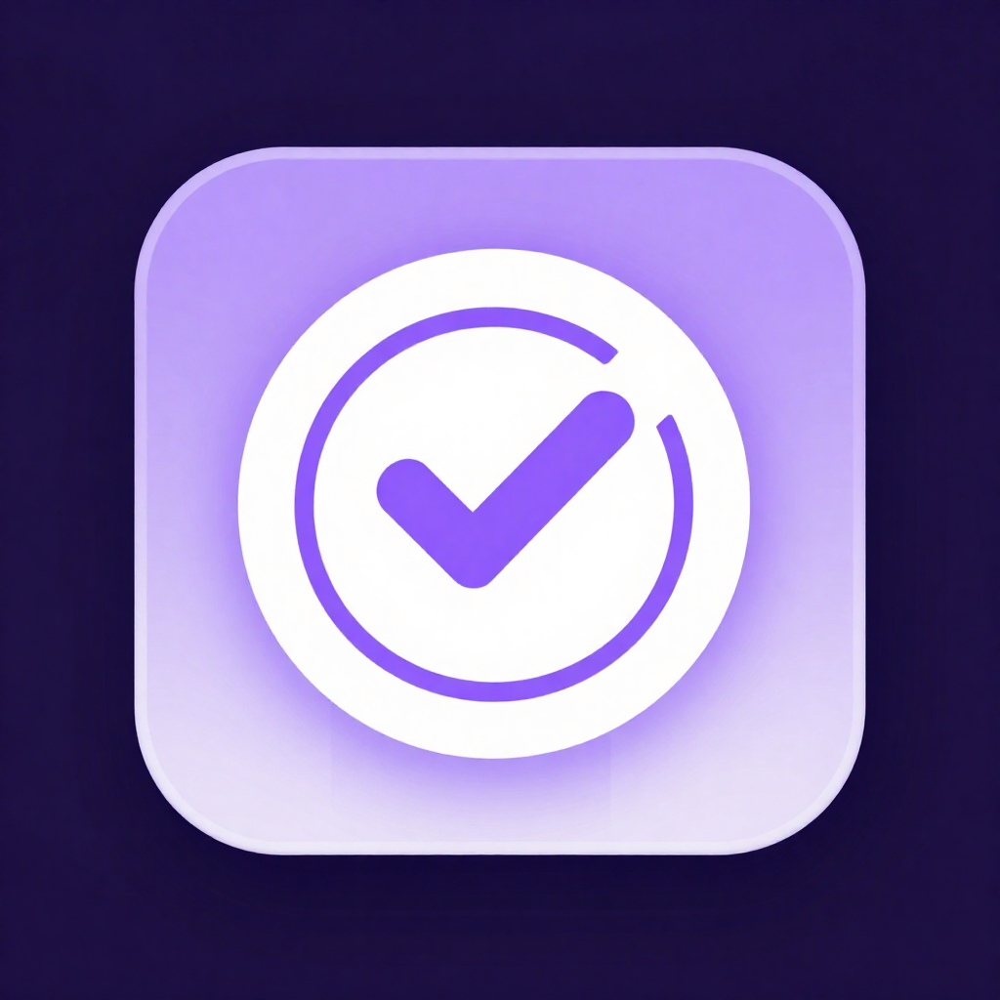

<!-- Animated cyan→violet header -->


<div align="center">
  

  <p>
    
  </p>

  <p>
    
    
    
    
  </p>
</div>

---

## ▸ Why

I wanted a single offline app that matched how I actually structure my day — a small
number of time blocks rather than an infinite to-do list — and could also handle a
few personal things (expenses, prayer times, make-up prayers) without sending any
data off the device. Every app I tried had a subscription, a cloud backend, or
missed one of these pieces. Daily Tracker is the version I actually use.

## ▸ Features

### Daily planning
- **Today** — live checklist with the currently active block highlighted; long-press
  a block card to attach a note
- **Custom blocks** — define your own time blocks with start/end, category, day-of-week
  bitmask, and an optional per-block reminder
- **History** — last 30 days with per-day completion percentage; tap any day to
  drill in
- **Stats** — 7 / 14 / 30-day bar chart, per-block completion frequency, and a running
  streak (via `fl_chart`)
- **Reminders** — local push notifications scheduled per block with
  `flutter_local_notifications`, timezone-aware via `timezone` + `flutter_timezone`,
  exact-alarm aware on Android 12+

### Beyond the schedule
- **Categories** — group blocks (work, study, faith, rest…) with color tagging
- **Expenses** — quick per-day expense logging on its own screen
- **Holidays** — mark days as off so streaks survive travel or leave
- **Prayer times** — computed locally via the `adhan` package; no network
- **Qada** — track make-up prayers (missed obligatory salah)
- **Home-screen widget** — Android widget via `home_widget`
- **Backup & share** — export/import data via `share_plus` + `file_picker`
- **Fully offline** — every byte lives in one SQLite DB on-device

## ▸ Architecture

```
lib/
├── main.dart
├── models/       Block, Completion, Category, Todo, Expense,
│                 Holiday, Prayer, Qada
├── providers/    TrackerProvider (Provider-based state)
├── services/     Notification, Prayer, Backup, Widget, Settings
├── db/           sqflite wrapper + seed data
├── screens/      Today, History, Stats, Categories, EditBlocks,
│                 Holidays, Expenses, Qada, Settings, Splash, Home
└── widgets/      BlockCard, Glass (glassmorphic panel)
```

- **State** — `provider` for minimal boilerplate; one `TrackerProvider` broadcasts
  to the screens that care
- **Persistence** — a single SQLite database via `sqflite`, schema in
  `lib/db/database.dart`
- **Notifications** — scheduled at app launch and re-synced on demand via the bell
  icon; respects `SCHEDULE_EXACT_ALARM` / `POST_NOTIFICATIONS` on Android 13+
- **Widget** — Android home-screen surface populated through `home_widget` so the
  user sees the current block without opening the app
- **No network calls** — prayer times are computed from coordinates, not fetched.
  Backup is user-initiated and writes to a local file the user chooses to share.

## ▸ Tech stack

- **Flutter** 3.3+ · **Dart**
- **provider** (state), **sqflite** (storage), **fl_chart** (stats charts)
- **flutter_local_notifications**, **timezone**, **flutter_timezone** (scheduled reminders)
- **adhan** (prayer time calculations), **home_widget** (Android widget)
- **share_plus**, **file_picker** (backup/restore)
- **shared_preferences** (settings), **intl** (locale-aware date formatting)

## ▸ Getting started

### 1. Regenerate the Android bootstrap

This repo checks in only the Flutter project source (no generated `android/` by
default). On a fresh clone, regenerate the platform scaffold:

```bash
flutter create --project-name daily_tracker --platforms android .
flutter pub get
```

### 2. Android permissions

Open `android/app/src/main/AndroidManifest.xml` and add inside `<manifest>`:

```xml
<uses-permission android:name="android.permission.POST_NOTIFICATIONS"/>
<uses-permission android:name="android.permission.SCHEDULE_EXACT_ALARM"/>
<uses-permission android:name="android.permission.USE_EXACT_ALARM"/>
<uses-permission android:name="android.permission.RECEIVE_BOOT_COMPLETED"/>
<uses-permission android:name="android.permission.WAKE_LOCK"/>
<uses-permission android:name="android.permission.VIBRATE"/>
```

Inside `<application>`, add the `flutter_local_notifications` receivers:

```xml
<receiver android:exported="false"
          android:name="com.dexterous.flutterlocalnotifications.ScheduledNotificationReceiver" />
<receiver android:exported="false"
          android:name="com.dexterous.flutterlocalnotifications.ScheduledNotificationBootReceiver">
    <intent-filter>
        <action android:name="android.intent.action.BOOT_COMPLETED"/>
    </intent-filter>
</receiver>
```

### 3. Gradle

In `android/app/build.gradle`:

- `compileSdk` 34 or higher
- `minSdk` 21 or higher
- Under `compileOptions`, set `coreLibraryDesugaringEnabled true`
- Under `dependencies`, add
  `coreLibraryDesugaring 'com.android.tools:desugar_jdk_libs:2.0.4'`

### 4. Run

Connect an Android device with USB debugging on (or start an emulator):

```bash
flutter run
```

### 5. Release APK (sideload)

```bash
flutter build apk --release
# Output: build/app/outputs/flutter-apk/app-release.apk
```

## ▸ Customizing the default schedule

The app ships with **no default blocks** — you build your own schedule from scratch.
If you want a prebuilt seed, edit `lib/db/default_blocks.dart` **before** the first
run (defaults are inserted only when the database is first created). To re-seed,
uninstall the app or clear its data and reinstall.

## ▸ Roadmap

- iOS build (currently Android-only)
- Weekly planning view alongside Today
- Exportable stats (PNG / PDF)
- Optional encrypted backup to a user-chosen cloud folder

## ▸ Author

**Anshad P P** — Full Stack Developer

[Portfolio](https://anshadpp.github.io/portfolio/) ·
[GitHub](https://github.com/anshadpp) ·
[LinkedIn](https://linkedin.com/in/anshad-p-p) ·
[Email](mailto:anshad.pp36@gmail.com)

<!-- Closing wave -->

